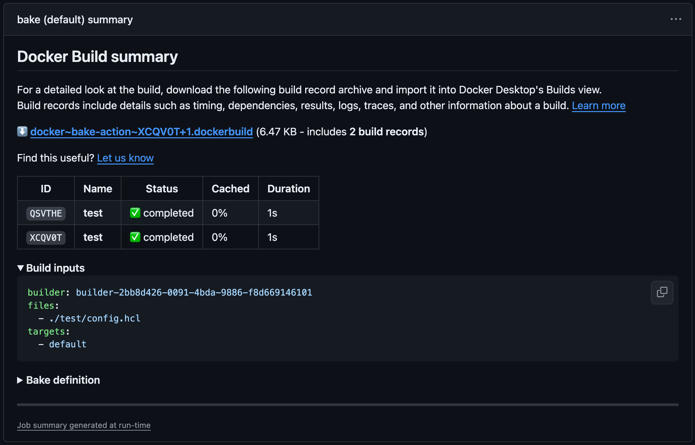

[](https://github.com/docker/bake-action/releases/latest)
[](https://github.com/marketplace/actions/docker-buildx-bake)
[](https://github.com/docker/bake-action/actions?workflow=ci)
[](https://github.com/docker/bake-action/actions?workflow=test)
[](https://codecov.io/gh/docker/bake-action)

## About

GitHub Action to use Docker [Buildx Bake](https://docs.docker.com/build/customize/bake/)
as a high-level build command.


___

* [Usage](#usage)
  * [Git context](#git-context)
  * [Path context](#path-context)
* [Summaries](#summaries)
* [Customizing](#customizing)
  * [inputs](#inputs)
  * [outputs](#outputs)
  * [environment variables](#environment-variables)
* [Subactions](#subactions)
  * [`list-targets`](subaction/list-targets)
* [Contributing](#contributing)

## Usage

### Git context

Since `v6` this action uses the [Git context](https://docs.docker.com/build/bake/remote-definition/)
to build from a remote bake definition by default like the [build-push-action](https://github.com/docker/build-push-action)
does. This means that you don't need to use the [`actions/checkout`](https://github.com/actions/checkout/)
action to check out the repository as [BuildKit](https://docs.docker.com/build/buildkit/)
will do this directly.

The git reference will be based on the [event that triggered your workflow](https://docs.github.com/en/actions/using-workflows/events-that-trigger-workflows)
and will result in the following context: `https://github.com/<owner>/<repo>.git#<ref>`.

```yaml
name: ci

on:
  push:

jobs:
  bake:
    runs-on: ubuntu-latest
    steps:
      -
        name: Login to DockerHub
        uses: docker/login-action@v3
        with:
          username: ${{ vars.DOCKERHUB_USERNAME }}
          password: ${{ secrets.DOCKERHUB_TOKEN }}
      -
        name: Set up Docker Buildx
        uses: docker/setup-buildx-action@v3
      -
        name: Build and push
        uses: docker/bake-action@v6
        with:
          push: true
          set: |
            *.tags=user/app:latest
```

Be careful because **any file mutation in the steps that precede the build step
will be ignored, including processing of the `.dockerignore` file** since
the context is based on the Git reference. However, you can use the
[Path context](#path-context) using the [`source` input](#inputs) alongside
the [`actions/checkout`](https://github.com/actions/checkout/) action to remove
this restriction.

Default Git context can also be provided using the [Handlebars template](https://handlebarsjs.com/guide/)
expression `{{defaultContext}}`. Here we can use it to provide a subdirectory
to the default Git context:

```yaml
      -
        name: Build and push
        uses: docker/bake-action@v6
        with:
          source: "{{defaultContext}}:mysubdir"
          push: true
          set: |
            *.tags=user/app:latest
```

Building from the current repository automatically uses the `GITHUB_TOKEN`
secret that GitHub [automatically creates for workflows](https://docs.github.com/en/actions/security-guides/automatic-token-authentication),
so you don't need to pass that manually. If you want to authenticate against
another private repository for remote definitions, you can set the
[`BUILDX_BAKE_GIT_AUTH_TOKEN` environment variable](https://docs.docker.com/build/building/variables/#buildx_bake_git_auth_token).

> [!NOTE]
> Supported since Buildx 0.14.0

```yaml
      -
        name: Build and push
        uses: docker/bake-action@v6
        with:
          push: true
          set: |
            *.tags=user/app:latest
        env:
          BUILDX_BAKE_GIT_AUTH_TOKEN: ${{ secrets.MYTOKEN }}
```

### Path context

```yaml
name: ci

on:
  push:

jobs:
  bake:
    runs-on: ubuntu-latest
    steps:
      -
        name: Checkout
        uses: actions/checkout@v4
      -
        name: Login to DockerHub
        uses: docker/login-action@v3
        with:
          username: ${{ vars.DOCKERHUB_USERNAME }}
          password: ${{ secrets.DOCKERHUB_TOKEN }}
      -
        name: Set up Docker Buildx
        uses: docker/setup-buildx-action@v3
      -
        name: Build and push
        uses: docker/bake-action@v6
        with:
          source: .
          push: true
          set: |
            *.tags=user/app:latest
```

## Summaries

This action generates a [job summary](https://github.blog/2022-05-09-supercharging-github-actions-with-job-summaries/)
that provides a detailed overview of the build execution. The summary shows an
overview of all the steps executed during the build, including the build
inputs, bake definition, and eventual errors.



The summary also includes a link for downloading a build record archive with
additional details about the build execution for all the bake targets,
including build stats, logs, outputs, and more. The build record can be
imported to Docker Desktop for inspecting the build in greater detail.

> [!WARNING]
>
> If you're using the [`actions/download-artifact`](https://github.com/actions/download-artifact)
> action in your workflow, you need to ignore the build record artifacts
> if `name` and `pattern` inputs are not specified ([defaults to download all artifacts](https://github.com/actions/download-artifact?tab=readme-ov-file#download-all-artifacts) of the workflow),
> otherwise the action will fail:
> ```yaml
> - uses: actions/download-artifact@v4
>   with:
>     pattern: "!*.dockerbuild"
> ```
> More info: https://github.com/actions/toolkit/pull/1874

Summaries are enabled by default, but can be disabled with the
`DOCKER_BUILD_SUMMARY` [environment variable](#environment-variables).

For more information about summaries, refer to the
[documentation](https://docs.docker.com/go/build-summary/).

## Customizing

### inputs

The following inputs can be used as `step.with` keys

> `List` type is a newline-delimited string
> ```yaml
> set: target.args.mybuildarg=value
> ```
> ```yaml
> set: |
>   target.args.mybuildarg=value
>   foo*.args.mybuildarg=value
> ```

> `CSV` type is a comma-delimited string
> ```yaml
> targets: default,release
> ```

| Name           | Type        | Description                                                                                                                                                        |
|----------------|-------------|--------------------------------------------------------------------------------------------------------------------------------------------------------------------|
| `builder`      | String      | Builder instance (see [setup-buildx](https://github.com/docker/setup-buildx-action) action)                                                                        |
| `source`       | String      | Context to build from. Can be either local (`.`) or a [remote bake definition](https://docs.docker.com/build/bake/remote-definition/)                              |
| `allow`        | List/CSV    | Allow build to access specified resources (e.g., `network.host`)                                                                                                   |
| `files`        | List/CSV    | List of [bake definition files](https://docs.docker.com/build/customize/bake/file-definition/)                                                                     |
| `workdir`      | String      | Working directory of execution                                                                                                                                     |
| `targets`      | List/CSV    | List of bake targets (`default` target used if empty)                                                                                                              |
| `no-cache`     | Bool        | Do not use cache when building the image (default `false`)                                                                                                         |
| `pull`         | Bool        | Always attempt to pull a newer version of the image (default `false`)                                                                                              |
| `load`         | Bool        | Load is a shorthand for `--set=*.output=type=docker` (default `false`)                                                                                             |
| `provenance`   | Bool/String | [Provenance](https://docs.docker.com/build/attestations/slsa-provenance/) is a shorthand for `--set=*.attest=type=provenance`                                      |
| `push`         | Bool        | Push is a shorthand for `--set=*.output=type=registry` (default `false`)                                                                                           |
| `sbom`         | Bool/String | [SBOM](https://docs.docker.com/build/attestations/sbom/) is a shorthand for `--set=*.attest=type=sbom`                                                             |
| `set`          | List        | List of [targets values to override](https://docs.docker.com/engine/reference/commandline/buildx_bake/#set) (e.g., `targetpattern.key=value`)                      |
| `github-token` | String      | API token used to authenticate to a Git repository for [remote definitions](https://docs.docker.com/build/bake/remote-definition/) (default `${{ github.token }}`) |

### outputs

The following outputs are available

| Name       | Type | Description           |
|------------|------|-----------------------|
| `metadata` | JSON | Build result metadata |

### environment variables

| Name                                 | Type   | Default | Description                                                                                                                                                                                                                                                        |
|--------------------------------------|--------|---------|--------------------------------------------------------------------------------------------------------------------------------------------------------------------------------------------------------------------------------------------------------------------|
| `DOCKER_BUILD_CHECKS_ANNOTATIONS`    | Bool   | `true`  | If `false`, GitHub annotations are not generated for [build checks](https://docs.docker.com/build/checks/)                                                                                                                                                         |
| `DOCKER_BUILD_SUMMARY`               | Bool   | `true`  | If `false`, [build summary](https://docs.docker.com/build/ci/github-actions/build-summary/) generation is disabled                                                                                                                                                 |
| `DOCKER_BUILD_RECORD_UPLOAD`         | Bool   | `true`  | If `false`, build record upload as [GitHub artifact](https://docs.github.com/en/actions/using-workflows/storing-workflow-data-as-artifacts) is disabled                                                                                                            |
| `DOCKER_BUILD_RECORD_RETENTION_DAYS` | Number |         | Duration after which build record artifact will expire in days. Defaults to repository/org [retention settings](https://docs.github.com/en/actions/learn-github-actions/usage-limits-billing-and-administration#artifact-and-log-retention-policy) if unset or `0` |
| `DOCKER_BUILD_EXPORT_LEGACY`         | Bool   | `false` | If `true`, exports build using legacy export-build tool instead of [`buildx history export` command](https://docs.docker.com/reference/cli/docker/buildx/history/export/)                                                                                          |

## Subactions

* [`list-targets`](subaction/list-targets)

## Contributing

Want to contribute? Awesome! You can find information about contributing to
this project in the [CONTRIBUTING.md](/.github/CONTRIBUTING.md)
