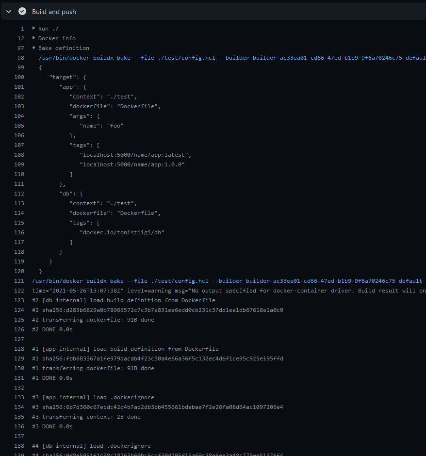

[](https://github.com/docker/bake-action/releases/latest)
[](https://github.com/marketplace/actions/docker-buildx-bake)
[](https://github.com/docker/bake-action/actions?workflow=test)
[](https://codecov.io/gh/docker/bake-action)

## :test_tube: Experimental

This repository is considered **EXPERIMENTAL** and under active development until further notice. It is subject to
non-backward compatible changes or removal in any future version so you should [pin to a specific tag/commit](https://docs.github.com/en/actions/creating-actions/about-actions#using-tags-for-release-management)
of  this action in your workflow (i.e `docker/bake-action@v1.1.3`).

## About

GitHub Action to use Docker [Buildx Bake](https://github.com/docker/buildx/blob/master/docs/reference/buildx_bake.md)
as a high-level build command.



___

* [Usage](#usage)
* [Customizing](#customizing)
  * [inputs](#inputs)
  * [outputs](#outputs)
* [Keep up-to-date with GitHub Dependabot](#keep-up-to-date-with-github-dependabot)

## Usage

```yaml
name: ci

on:
  push:
    branches:
      - 'master'

jobs:
  bake:
    runs-on: ubuntu-latest
    steps:
      -
        name: Checkout
        uses: actions/checkout@v3
      -
        name: Set up Docker Buildx
        uses: docker/setup-buildx-action@v2
      -
        name: Login to DockerHub
        uses: docker/login-action@v2
        with:
          username: ${{ secrets.DOCKERHUB_USERNAME }}
          password: ${{ secrets.DOCKERHUB_TOKEN }}
      -
        name: Build and push
        uses: docker/bake-action@master
        with:
          push: true
```

## Customizing

### inputs

Following inputs can be used as `step.with` keys

> `List` type is a newline-delimited string
> ```yaml
> set: target.args.mybuildarg=value
> ```
> ```yaml
> set: |
>   target.args.mybuildarg=value
>   foo*.args.mybuildarg=value
> ```

> `CSV` type is a comma-delimited string
> ```yaml
> targets: default,release
> ```

| Name       | Type     | Description                                                                                                                                          |
|------------|----------|------------------------------------------------------------------------------------------------------------------------------------------------------|
| `builder`  | String   | Builder instance (see [setup-buildx](https://github.com/docker/setup-buildx-action) action)                                                          |
| `files`    | List/CSV | List of [bake definition files](https://github.com/docker/buildx/blob/master/docs/reference/buildx_bake.md#file)                                     |
| `workdir`  | String   | Working directory of execution                                                                                                                       |
| `targets`  | List/CSV | List of bake targets                                                                                                                                 |
| `no-cache` | Bool     | Do not use cache when building the image (default `false`)                                                                                           |
| `pull`     | Bool     | Always attempt to pull a newer version of the image (default `false`)                                                                                |
| `load`     | Bool     | Load is a shorthand for `--set=*.output=type=docker` (default `false`)                                                                               |
| `push`     | Bool     | Push is a shorthand for `--set=*.output=type=registry` (default `false`)                                                                             |
| `set`      | List     | List of [targets values to override](https://github.com/docker/buildx/blob/master/docs/reference/buildx_bake.md#set) (eg: `targetpattern.key=value`) |
| `source`   | String   | [Remote bake definition](https://github.com/docker/buildx/blob/master/docs/guides/bake/file-definition.md#remote-definition) to build from           |

### outputs

Following outputs are available

| Name              | Type    | Description                           |
|-------------------|---------|---------------------------------------|
| `metadata`        | JSON    | Build result metadata |

## Keep up-to-date with GitHub Dependabot

Since [Dependabot](https://docs.github.com/en/github/administering-a-repository/keeping-your-actions-up-to-date-with-github-dependabot)
has [native GitHub Actions support](https://docs.github.com/en/github/administering-a-repository/configuration-options-for-dependency-updates#package-ecosystem),
to enable it on your GitHub repo all you need to do is add the `.github/dependabot.yml` file:

```yaml
version: 2
updates:
  # Maintain dependencies for GitHub Actions
  - package-ecosystem: "github-actions"
    directory: "/"
    schedule:
      interval: "daily"
```
