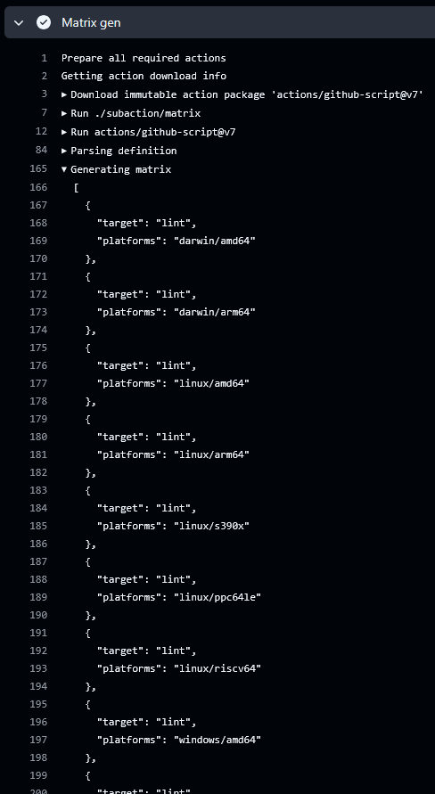

## About

This subaction generates a multi-dimension matrix that can be used in a [GitHub matrix](https://docs.github.com/en/actions/using-workflows/workflow-syntax-for-github-actions#jobsjob_idstrategymatrix)
through the [`include` property](https://docs.github.com/en/actions/how-tos/writing-workflows/choosing-what-your-workflow-does/running-variations-of-jobs-in-a-workflow#expanding-or-adding-matrix-configurations)
so you can distribute your builds across multiple runners.



___

* [Usage](#usage)
* [Customizing](#customizing)
  * [inputs](#inputs)
  * [outputs](#outputs)

## Usage

### List targets

```hcl
# docker-bake.hcl
group "validate" {
  targets = ["lint", "doctoc"]
}

target "lint" {
  target = "lint"
}

target "doctoc" {
  target = "doctoc"
}
```

```yaml
jobs:
  prepare:
    runs-on: ubuntu-latest
    outputs:
      matrix: ${{ steps.generate.outputs.matrix }}
    steps:
      -
        name: Checkout
        uses: actions/checkout@v4
      -
        name: Generate matrix
        id: generate
        uses: docker/bake-action/subaction/matrix@v6
        with:
          target: validate

  validate:
    runs-on: ubuntu-latest
    needs:
      - prepare
    strategy:
      fail-fast: false
      matrix:
        include: ${{ fromJson(needs.prepare.outputs.matrix) }}
    steps:
      -
        name: Validate
        uses: docker/bake-action@v6
        with:
          targets: ${{ matrix.target }}
```

### Platforms split

```hcl
# docker-bake.hcl
target "lint" {
  dockerfile = "./hack/dockerfiles/lint.Dockerfile"
  output = ["type=cacheonly"]
  platforms = [
    "darwin/amd64",
    "darwin/arm64",
    "linux/amd64",
    "linux/arm64",
    "linux/s390x",
    "linux/ppc64le",
    "linux/riscv64",
    "windows/amd64",
    "windows/arm64"
  ]
}
```

```yaml
jobs:
  prepare:
    runs-on: ubuntu-latest
    outputs:
      matrix: ${{ steps.generate.outputs.matrix }}
    steps:
      -
        name: Checkout
        uses: actions/checkout@v4
      -
        name: Generate matrix
        id: generate
        uses: docker/bake-action/subaction/matrix@v6
        with:
          target: lint
          fields: platforms

  lint:
    runs-on: ${{ startsWith(matrix.platforms, 'linux/arm') && 'ubuntu-24.04-arm' || 'ubuntu-latest' }}
    needs:
      - prepare
    strategy:
      fail-fast: false
      matrix:
        include: ${{ fromJson(needs.prepare.outputs.matrix) }}
    steps:
      -
        name: Lint
        uses: docker/bake-action@v6
        with:
          targets: ${{ matrix.target }}
          set: |
            *.platform=${{ matrix.platforms }}
```

## Customizing

### inputs

| Name      | Type     | Description                                                                                    |
|-----------|----------|------------------------------------------------------------------------------------------------|
| `workdir` | String   | Working directory to use (defaults to `.`)                                                     |
| `files`   | List/CSV | List of [bake definition files](https://docs.docker.com/build/customize/bake/file-definition/) |
| `target`  | String   | The target to use within the bake file                                                         |
| `fields`  | String   | List of extra fields to include in the matrix                                                  |

### outputs

| Name     | Type | Description          |
|----------|------|----------------------|
| `matrix` | JSON | Matrix configuration |
