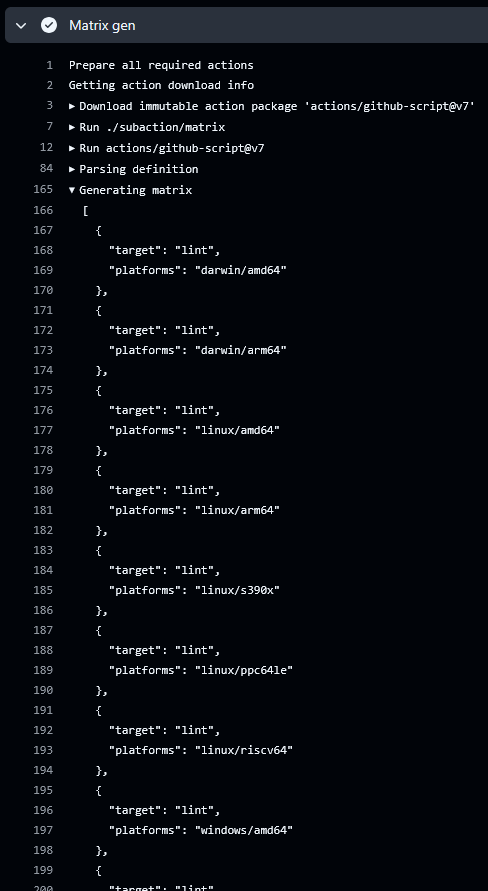

## About

This subaction generates a multi-dimension matrix that can be used in a [GitHub matrix](https://docs.github.com/en/actions/using-workflows/workflow-syntax-for-github-actions#jobsjob_idstrategymatrix)
through the [`include` property](https://docs.github.com/en/actions/how-tos/writing-workflows/choosing-what-your-workflow-does/running-variations-of-jobs-in-a-workflow#expanding-or-adding-matrix-configurations)
so you can distribute your builds across multiple runners.



___

* [Usage](#usage)
* [Layered matrix](#layered-matrix)
* [Customizing](#customizing)
  * [inputs](#inputs)
  * [outputs](#outputs)

## Usage

### List targets

```hcl
# docker-bake.hcl
group "validate" {
  targets = ["lint", "doctoc"]
}

target "lint" {
  target = "lint"
}

target "doctoc" {
  target = "doctoc"
}
```

```yaml
jobs:
  prepare:
    runs-on: ubuntu-latest
    outputs:
      matrix: ${{ steps.generate.outputs.matrix }}
    steps:
      -
        name: Checkout
        uses: actions/checkout@v6
      -
        name: Generate matrix
        id: generate
        uses: docker/bake-action/subaction/matrix@v7
        with:
          target: validate

  validate:
    runs-on: ubuntu-latest
    needs:
      - prepare
    strategy:
      fail-fast: false
      matrix:
        include: ${{ fromJson(needs.prepare.outputs.matrix) }}
    steps:
      -
        name: Validate
        uses: docker/bake-action@v7
        with:
          targets: ${{ matrix.target }}
```

### Platforms split

```hcl
# docker-bake.hcl
target "lint" {
  dockerfile = "./hack/dockerfiles/lint.Dockerfile"
  output = ["type=cacheonly"]
  platforms = [
    "darwin/amd64",
    "darwin/arm64",
    "linux/amd64",
    "linux/arm64",
    "linux/s390x",
    "linux/ppc64le",
    "linux/riscv64",
    "windows/amd64",
    "windows/arm64"
  ]
}
```

```yaml
jobs:
  prepare:
    runs-on: ubuntu-latest
    outputs:
      matrix: ${{ steps.generate.outputs.matrix }}
    steps:
      -
        name: Checkout
        uses: actions/checkout@v6
      -
        name: Generate matrix
        id: generate
        uses: docker/bake-action/subaction/matrix@v7
        with:
          target: lint
          fields: platforms

  lint:
    runs-on: ${{ startsWith(matrix.platforms, 'linux/arm') && 'ubuntu-24.04-arm' || 'ubuntu-latest' }}
    needs:
      - prepare
    strategy:
      fail-fast: false
      matrix:
        include: ${{ fromJson(needs.prepare.outputs.matrix) }}
    steps:
      -
        name: Lint
        uses: docker/bake-action@v7
        with:
          targets: ${{ matrix.target }}
          set: |
            *.platform=${{ matrix.platforms }}
```

## Layered matrix

If your bake definition contains targets depending on other targets
you may want to take advantage of the layered matrix generated by this action.
The layered matrix is an array of multi-dimensional matrices
where the targets of each layer depend on the targets of the previous one.
This allows you to create workflows which build dependencies first
and avoid duplicate work when building targets.

Note however, that this is only intended as a helper feature
and doesn't make the results of earlier builds available in later jobs.
You still need to implement a way to reuse previous builds yourself to avoid duplicate work.

### Examples

#### Simple

```hcl
group "default" {
  targets = ["apps", "special-app"]
}

target "base" {
  context = "basedir"
  tags = ["base:latest"]
}

target "apps" {
  name = "app_${version}"
  context = "appdir/${version}"
  matrix = {
    version = ["1-0-0", "2-0-0", "2-1-5"]
  }
  tags = ["app:${version}"]
  contexts = {
    base = "target:base"
  }
}

target "special-app" {
    context = "appdir/special"
    tags = ["special-app:latest"]
    contexts = {
      app = "target:app_2-0-0"
    }
}
```

```yaml
jobs:
  prepare:
    runs-on: ubuntu-latest
    env:
      MAX_LAYERS: 3
    outputs:
      layers: ${{ steps.generate.outputs.layers }}
      layered-matrix: ${{ steps.generate.outputs.layered-matrix }}
    steps:
      -
        name: Checkout
        uses: actions/checkout@v6
      -
        name: Generate matrix
        id: generate
        uses: docker/bake-action/subaction/matrix@v7
      -
        name: Verify configured max amount of layers
        run: |
          test "${{ steps.generate.outputs.max-layers }}" -eq "${MAX_LAYERS}"

  layer_1:
    runs-on: ubuntu-latest
    needs:
      - prepare
    if: ${{ fromJson(needs.prepare.outputs.layers) >= 1 }}
    strategy:
      matrix:
        include: ${{ toJson(fromJson(needs.prepare.outputs.layered-matrix)[0]) }}
    steps:
      -
        name: Build
        uses: docker/bake-action@v7
        with:
          targets: ${{ matrix.target }}

  layer_2:
    runs-on: ubuntu-latest
    needs:
      - prepare
      - layer_1
    if: ${{ fromJson(needs.prepare.outputs.layers) >= 2 }}
    strategy:
      matrix:
        include: ${{ toJson(fromJson(needs.prepare.outputs.layered-matrix)[1]) }}
    steps:
      -
        name: Build
        uses: docker/bake-action@v7
        with:
          targets: ${{ matrix.target }}

  layer_3:
    runs-on: ubuntu-latest
    needs:
      - prepare
      - layer_2
    if: ${{ fromJson(needs.prepare.outputs.layers) >= 3 }}
    strategy:
      matrix:
        include: ${{ toJson(fromJson(needs.prepare.outputs.layered-matrix)[2]) }}
    steps:
      -
        name: Build
        uses: docker/bake-action@v7
        with:
          targets: ${{ matrix.target }}
```

#### Reuse previous builds with pushed image refs

```hcl
variable "CI_BUILD" {
  default = false
}

group "default" {
  targets = ["apps", "special-app"]
}

target "base" {
  context = "basedir"
  tags = ["base:latest"]
}

target "apps" {
  name = "app_${version}"
  context = "appdir/${version}"
  matrix =  {
    version = ["1-0-0", "2-0-0", "2-1-5"]
  }
  tags = ["app:${version}"]
  contexts = {
    base = CI_BUILD ? "docker-image://base:latest" : "target:base"
  }
}

target "special-app" {
  context = "appdir/special"
  tags = ["special-app:latest"]
  contexts = {
    app = CI_BUILD ? "docker-image://app:2-0-0" : "target:app_2-0-0"
  }
}
```

```yaml
jobs:
  prepare:
    runs-on: ubuntu-latest
    env:
      MAX_LAYERS: 3
    outputs:
      layers: ${{ steps.generate.outputs.layers }}
      layered-matrix: ${{ steps.generate.outputs.layered-matrix }}
    steps:
      -
        name: Checkout
        uses: actions/checkout@v6
      -
        name: Generate matrix
        id: generate
        uses: docker/bake-action/subaction/matrix@v7
      -
        name: Verify configured max amount of layers
        run: |
          test "${{ steps.generate.outputs.max-layers }}" -eq "${MAX_LAYERS}"

  layer_1:
    runs-on: ubuntu-latest
    env:
      CI_BUILD: true
    needs:
      - prepare
    if: ${{ fromJson(needs.prepare.outputs.layers) >= 1 }}
    strategy:
      matrix:
        include: ${{ toJson(fromJson(needs.prepare.outputs.layered-matrix)[0]) }}
    steps:
      -
        name: Build and push
        uses: docker/bake-action@v7
        with:
          targets: ${{ matrix.target }}
          push: true

  layer_2:
    runs-on: ubuntu-latest
    env:
      CI_BUILD: true
    needs:
      - prepare
      - layer_1
    if: ${{ fromJson(needs.prepare.outputs.layers) >= 2 }}
    strategy:
      matrix:
        include: ${{ toJson(fromJson(needs.prepare.outputs.layered-matrix)[1]) }}
    steps:
      -
        name: Build and push
        uses: docker/bake-action@v7
        with:
          targets: ${{ matrix.target }}
          push: true

  layer_3:
    runs-on: ubuntu-latest
    env:
      CI_BUILD: true
    needs:
      - prepare
      - layer_2
    if: ${{ fromJson(needs.prepare.outputs.layers) >= 3 }}
    strategy:
      matrix:
        include: ${{ toJson(fromJson(needs.prepare.outputs.layered-matrix)[2]) }}
    steps:
      -
        name: Build and push
        uses: docker/bake-action@v7
        with:
          targets: ${{ matrix.target }}
          push: true
```

## Customizing

### inputs

| Name      | Type     | Description                                                                                    |
|-----------|----------|------------------------------------------------------------------------------------------------|
| `workdir` | String   | Working directory to use (defaults to `.`)                                                     |
| `files`   | List/CSV | List of [bake definition files](https://docs.docker.com/build/customize/bake/file-definition/) |
| `target`  | String   | The target to use within the bake file                                                         |
| `fields`  | String   | List of extra fields to include in the matrix                                                  |

### outputs

| Name             | Type    | Description                                    |
|------------------|---------|------------------------------------------------|
| `matrix`         | JSON    | Matrix configuration                           |
| `max-layers`     | Integer | Amount of layers required to build all targets |
| `layered-matrix` | JSON    | Layered matrix configuration                   |
| `layers`         | Integer | Amount of layers present in `layered-matrix`   |
